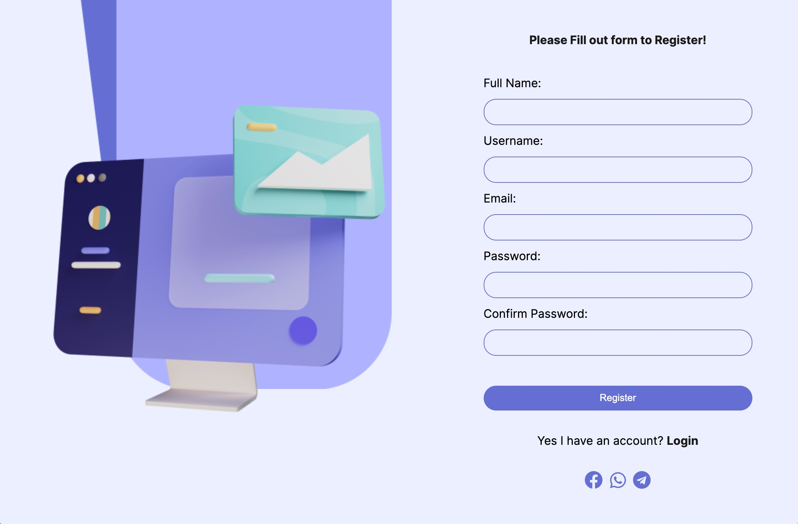

# Repte #3 - Login & Sign Up

## Description
At this repository you can find the Login and Sign Up forms with a complete validation. 

You can also see the project deployed [here](https://chaiben.github.io/repte-3-login-and-sign-up/).

### Objectives

- The User can see the Log In view.
- The User can see Sign Up view.
- The User cannot submit the form if there is any empty input (both login and signup).
- Email must be in the correct format, otherwise an error popup must be displayed.
- The password must comply with:
    - Minimum 6 characters.
    - Use at least one capital letter.
    - Use at least a lowercase letter.
    - Contain some special character: . | , | * | + | -
    - The form cannot be submitted if the passwords do not match (you must receive an error message).
- The Username cannot contain spaces or periods.
- Deploy the web

## Screen shots

## How to install

1. Clone this repository 
    > `git clone https://github.com/chaiben/repte-3-login-and-sign-up`
2. Access the app directory
    > `cd login-and-sign-up`
4. Install all 
    >`npm install`
5. Run
    >`npm start`

## How to use

This app does the form validation. If the validation return an error, it will be shown. If any error is found, the app will print the form data at a console log.

## References used
- [Deploy to GIT pages](https://create-react-app.dev/docs/deployment/#github-pages)
- [Youtube - How to Deploy React App to GitHub Pages](https://www.youtube.com/watch?v=F8s4Ng-re0E)
- [Formik - React Component to Form validations](https://formik.org/)
- [Test Regex expressions](https://regexr.com/)

## Some metrics

